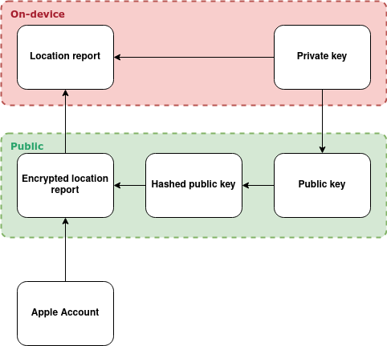

# The Network

This page aims to provide an overview of how the Find My-network works on a technical level.
It does this by explaining in detail what data the tags are broadcasting, how this is picked up
by surrounding iDevices, and how generated location reports can be retrieved.

```{note}
While official AirTags (and compatible 3rd party tags) use the same principles as described
in this document, they also offer a key rotation feature. To learn more about
how this works, please check out the dedicated [AirTags](#11-AirTags) page.
```

## Overview

Simply said, the FindMy-network works by having accessories such as AirTags broadcast a unique signal over bluetooth.
Any nearby iDevice, such as iPhones or iPads, are able to receive this signal. Once the device is aware of the nearby
accessory, it will upload its current location to Apple's servers, from where it can be retrieved by the owner of the accessory.

Apple has put a lot of effort into making the network as private as possible. By utilizing encryption,
it is possible for finder devices to encrypt their location with a key that the accessory is broadcasting
before sending it to Apple. This public key allows encryption of certain data, but not decryption. In order
to download location reports for the accessory, we therefore need the private key corresponding to said public key.
These keys, together called a key pair, were generated and exchanged when the accessory was first paired and are now
stored on the owner's devices. By downloading the correct encrypted location reports and then locally decrypting
said reports using the private key, users are able to track their devices without Apple ever being able to read the location.


_An overview of the FindMy-network. Source: [SEEMOO-LAB](https://www.petsymposium.org/2021/files/papers/issue3/popets-2021-0045.pdf)_.

Fetching (encrypted) location reports still requires an Apple account. It is worth noting however, that anyone can download
anyone else's location reports for any of their devices; however, due to the encryption scheme discussed above,
doing this would be rather useless as none of the retrieved reports could be decrypted. This scheme allows devices
to operate without being linked to a specific Apple account. The below dependency diagram visually explains how this entire
system hinges on the availability of the private key; without it, location reports could not be retrieved and decrypted.



_A dependency diagram of data in the network. An arrow pointing from A to B means that in order
to retrieve B, we first require A._
